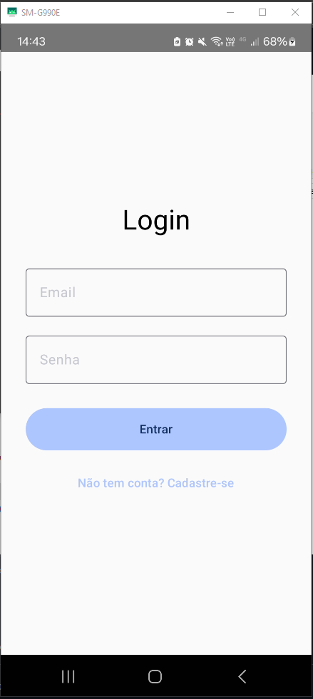
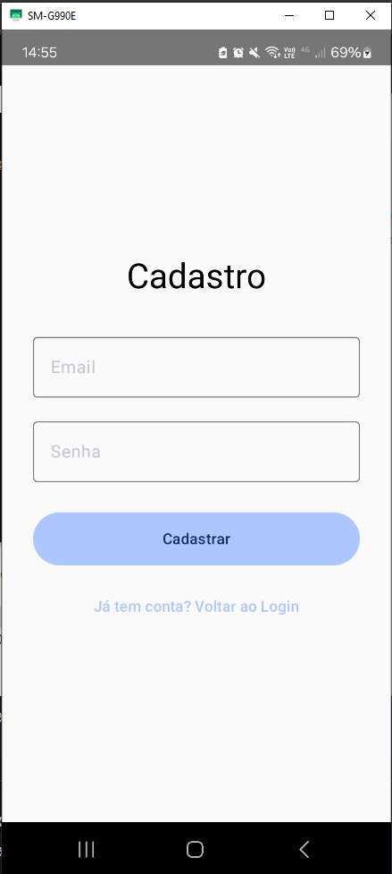
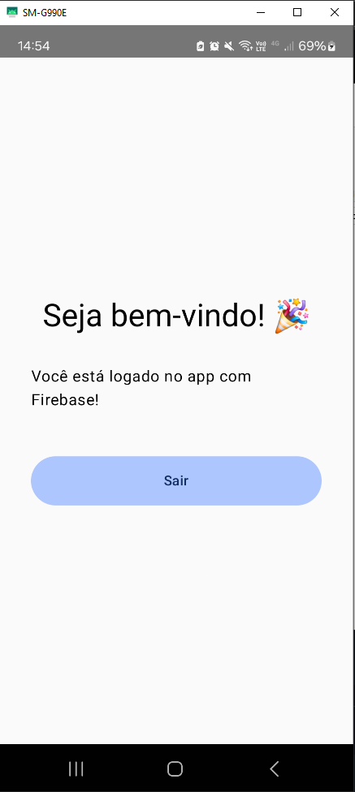

# 📱 AppLoginFirebaseCompose

Um aplicativo Android desenvolvido em **Kotlin** utilizando **Jetpack Compose** e integração com **Firebase Authentication**. Permite que usuários realizem cadastro, login e logout de forma segura, simples e moderna.

---

## ✨ Funcionalidades
- 🔐 Autenticação de usuários com **Email e Senha**.
- 📲 Interface moderna, feita 100% em **Jetpack Compose**.
- 🔄 **Layout Responsivo**, se adapta a diferentes tamanhos de tela.
- ✅ Login, cadastro e logout funcionando com integração real ao **Firebase Authentication**.

---

## 🖥️ Telas do Aplicativo

| Tela de Login | Tela de Cadastro | Tela Inicial |
|----------------|------------------|---------------|
|  |  |  |

---

## 🔧 Tecnologias Utilizadas
- ✅ **Kotlin**
- ✅ **Jetpack Compose**
- ✅ **Material 3 (Material You)**
- ✅ **Firebase Authentication**
- ✅ **Android Studio**

---

## 🚀 Como executar
1. Clone este repositório:
```
git clone https://github.com/Luskinha04/AppLoginFirebaseJetpackCompose
```

2. Abra o projeto no **Android Studio**.
3. Adicione seu arquivo `google-services.json` na pasta:

```
app/
```

4. Execute o projeto em um emulador ou dispositivo físico.

---

## 🔥 Prints das Telas

As imagens estão salvas na pasta:

```
/Screenshots
```

---

## ☁️ Firebase

* Este projeto utiliza **Firebase Authentication**.
* Para utilizar, crie um projeto no Firebase e ative o método de login por **Email e Senha**.

---

## 💡 Observações

* ✅ Projeto desenvolvido para a disciplina de desenvolvimento mobile.
* ✅ Cumpre os requisitos de responsividade e integração com backend.

---

## 🏆 Status do Projeto

> ✅ **Finalizado e funcionando perfeitamente!**

---

## ✍️ Autor

**Lucas Lemos (Luskinha04)**  
Projeto feito com 💜 para fins acadêmicos

---

> **IFTM - Instituto Federal do Triângulo Mineiro**  
> **Curso:** Análise e Desenvolvimento de Sistemas  
> **Disciplina:** Inteligência Computacional
> **Período:** 6º Semestre

